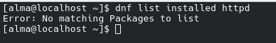
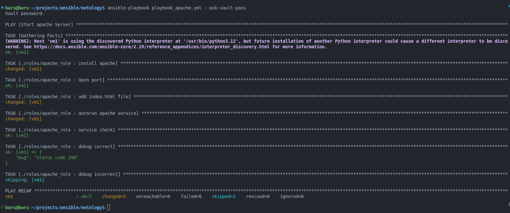
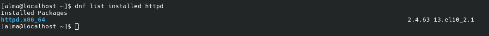
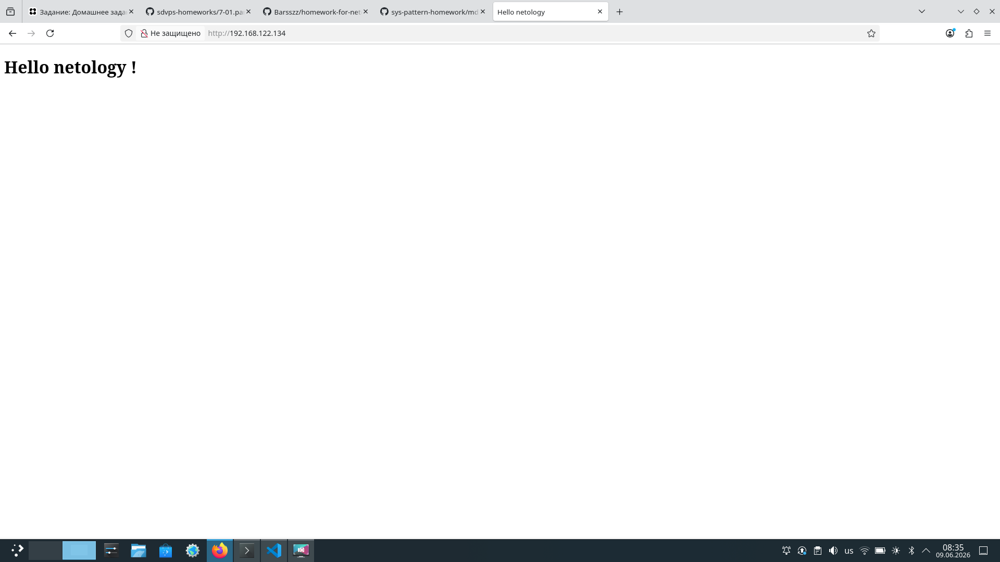
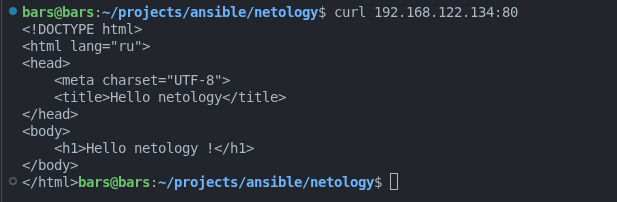

# Домашнее задание к занятию "Ansible. Часть 2" - Бибарцев В.Т.

---
1. `Я использовал для выполнения домашнего задания ВМ (ОС AlmaLinux) поднятую с помощью virsh. В директории group_var -> servers хранится зашифрованный с помощью ansible-vault файл "secret.yml" и переменные в файле "vars.yml"`
2. `Задания № 1 и 2 выполнены в одном плейбуке под названием "playbook_download.yml"`

#### Код файла vars.yml

```yaml
motd_var: "Hello netology!"
motd_var_modify: | 
  Hello dear {{ ansible_hostname }}
  Ipv4: {{ ansible_default_ipv4.address }}
  Good day !
```

Переменные я использовал для задания 1.3 и задания 2.

### Задание 1

1. #### Скачать какой-либо архив, создать папку для распаковки и распаковать скаченный архив. Например, можете использовать официальный сайт и зеркало Apache Kafka. При этом можно скачать как исходный код, так и бинарные файлы, запакованные в архив — в нашем задании не принципиально.

`Объяснение кода`

1. Сперва создаем директории, в которые будет загружен и распакован архив.
2. Поскольку ВМ была полностью "голая" я установил пакет tar.
3. Далее идет скачивание самого архива. Также в этом блоке я поставилл метку для дебага, чтобы убедиться, что архив скачан.
4. Потом идет распаковка архива.
5. В последнем блоке идет проверка на то, что архив скачался.

#### Сам плейбук

```yaml
- name: create dir and download archive
  hosts: servers
  become: yes
  tasks:
    - name: create dir for download
      file:
        path: /home/alma/for_download
        state: directory
        mode: '755'

    - name: create dir for unarchive
      file:
        path: '/home/alma/for_unarchive'
        state: directory
        mode: '755'
    
    - name: install tar
      dnf:
        name:
          - tar
        state: present

    - name: download archive apache kafka
      ansible.builtin.get_url:
        url: 'https://www.apache.org/dyn/closer.lua/kafka/4.2.1/kafka-4.2.1-src.tgz?action=download'
        dest: '/home/alma/for_download/kafka_2.13-4.3.0.tgz'
        mode: '644'
      register: archive_check

    - name: unarchive archive
      ansible.builtin.unarchive:
        src: '/home/alma/for_download/kafka_2.13-4.3.0.tgz'
        dest: '/home/alma/for_unarchive'
        remote_src: yes

    - name: debug
      debug:
        msg: "{{ 'Архив успешно скачан' if archive_check.changed else 'Архив не скачан/был скачан' }}"
```

2. #### Установить пакет tuned из стандартного репозитория вашей ОС. Запустить его, как демон — конфигурационный файл systemd появится автоматически при установке. Добавить tuned в автозагрузку.

#### Сам плейбук

```yaml
- name: install tuned
      dnf:
        name:
          - tuned
        state: present
    
    - name: add tuned to startup
      ansible.builtin.service:
        name: tuned
        state: started
        enabled: yes
```

3. #### Изменить приветствие системы (motd) при входе на любое другое. Пожалуйста, в этом задании используйте переменную для задания приветствия. Переменную можно задавать любым удобным способом.

#### Сам плейбук

```yaml
- name: changed motd
      ansible.builtin.copy:
        content: '{{ motd_var }}'
        dest: '/etc/motd.d/00-start'
        mode: '644'
```

`Переменная "motd_var" лежит в файле group_var -> servers -> vars.yml`

`Сама переменная`

```yaml
motd_var: "Hello netology!"
```

---

### Задание 2

#### Модифицируйте плейбук из пункта 3, задания 1. В качестве приветствия он должен установить IP-адрес и hostname управляемого хоста, пожелание хорошего дня системному администратору.

#### Сам плейбук

```yaml
  - name: modify motd
      ansible.builtin.copy:
        content: '{{ motd_var_modify }}'
        dest: '/etc/motd.d/00-welcome'
        mode: '644'
```

`Как и в предыдущем пункте переменная лежит по пути: group_var -> servers -> vars.yml`

`Сама переменная`

```yaml
motd_var_modify: | 
  Hello dear {{ ansible_hostname }}
  Ipv4: {{ ansible_default_ipv4.address }}
  Good day !
```
---

### Задание 3

#### Создайте плейбук, который будет включать в себя одну, созданную вами роль. Роль должна:

####   1. Установить веб-сервер Apache на управляемые хосты.
####   2. Сконфигурировать файл index.html c выводом характеристик каждого компьютера как веб-страницу по умолчанию для Apache. Необходимо включить CPU,  RAM,       величину первого HDD, IP-адрес. Используйте Ansible facts и jinja2-template. Необходимо реализовать handler: перезапуск Apache только в случае изменения файла конфигурации Apache.
####  3. Открыть порт 80, если необходимо, запустить сервер и добавить его в автозагрузку.
####   4. Сделать проверку доступности веб-сайта (ответ 200, модуль uri).

`Весь код этого задания лежит в директории "roles".`

`Переменные`

```yaml
package_name: httpd 
service_name: httpd
web_path: '/var/www/html'
index_file: index.html
apache_port: 80
```

`Код для handlers`

```yaml
- name: restart apache service
  ansible.builtin.service:
    name: '{{ service_name }}'
    state: restarted
```

`Код для tasks`

```yaml
- name: install apache
  ansible.builtin.dnf:
    name:
      - httpd
    state: present
  
- name: Open port
  ansible.posix.firewalld:
    port: '{{ apache_port }}/tcp'
    permanent: yes
    immediate: yes
    state: enabled

- name: add index.html file
  ansible.builtin.template:
    src: index.html
    dest: '{{ web_path }}/{{ index_file }}'
    mode: '644'

- name: autorun apache service 
  ansible.builtin.service:
    name: '{{ service_name }}'
    state: started
    enabled: yes

- name: service check
  ansible.builtin.uri:
    url: 'http://{{ ansible_default_ipv4.address }}:{{ apache_port }}'
    return_content: no
    status_code:
      - 200
  register: apache_check

- name: debug correct
  ansible.builtin.debug:
    msg: 'Status code 200'
  when: apache_check.status == 200 

- name: debug incorrect
  ansible.builtin.debug:
    msg: 'Server is unavailable'
  when: apache_check.status != 200
```

`Объяснение кода`

1. install apache - устанавливает пакет httpd
2. Open port - открывает порт 80
3. add index.html file - добавляет файл из шаблона index.html
4. autorun apache service - добавляет apache в автозагрузку
5. service check - проверка, что сервер работает
6. debug выводят сообщения о том, что сервер поднялся или нет

`Код для шаблона index.html`

```html
<!DOCTYPE html>
<html lang="ru">
<head>
    <meta charset="UTF-8">
    <title>Hello netology</title>
</head>
<body>
    <h1>Hello netology !</h1>
</body>
</html>
```

---

`Скриншоты`

Сейчас httpd нет на ВМ



Запуск плейбука и удачное выполнение



httpd удачно установился на удаленный хост



Скриншот из браузера



Возвращаем curl запрос

